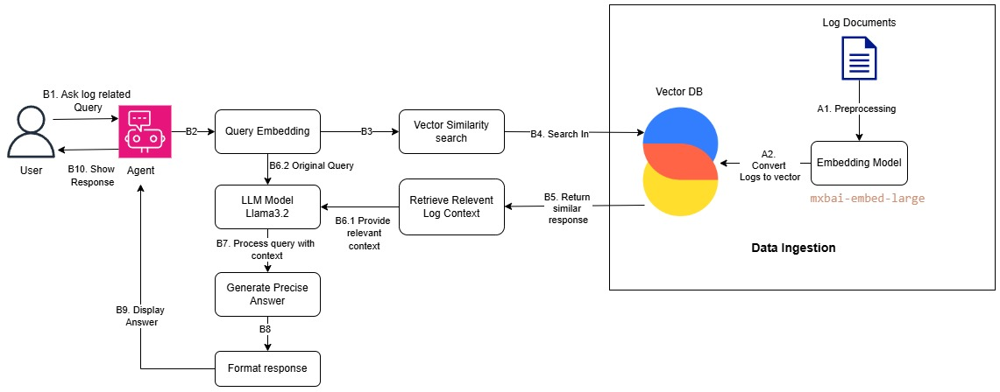

# AI Log Monitoring Application

An intelligent application for analyzing application logs using AI. This tool leverages Natural Language Processing and Retrieval Augmented Generation (RAG) to allow users to ask questions about their logs in natural language.

## Features

- **Natural Language Queries**: Ask questions about your logs in plain English
- **Smart Filtering**: Filter logs by time periods (last 24 hours, last week, specific months)
- **Vector Database Viewer**: Explore the vector database contents directly in the UI
- **Source Verification**: View the actual log entries that were used to generate answers
- **Time-Based Filtering**: Filter logs by custom date ranges, specific months, or relative time periods

## Examples of Queries

- "How many ERROR logs are there?"
- "Show me database errors from the last 24 hours"
- "What happened in March 2025?"
- "Show logs from January 10 to January 15"

## Project Structure

- `main.py` - Streamlit application entrypoint
- `log_processor.py` - Processes log files and extracts metadata
- `vector_store.py` - Handles vector embedding and Chroma DB setup
- `rag_chain.py` - Sets up the RAG chain for answering questions
- `application_logs.txt` - Sample log file

## Getting Started

### Prerequisites

- Python 3.9+
- Ollama with models:
  - llama3.2
  - mxbai-embed-large

### Installation

1. Clone this repository
2. Install dependencies:
   ```bash
   pip install -r requirements.txt
   ```
3. Ensure Ollama is running with the required models

### Usage

1. Build the vector store (first time only):
   ```bash
   python vector_store.py
   ```

2. Run the application:
   ```bash
   streamlit run main.py
   ```

3. Open your browser and navigate to `http://localhost:8501`

## Technical Details

- **Vector Database**: ChromaDB for efficient semantic search
- **Embeddings**: mxbai-embed-large model via Ollama
- **LLM**: llama3.2 via Ollama
- **UI Framework**: Streamlit


